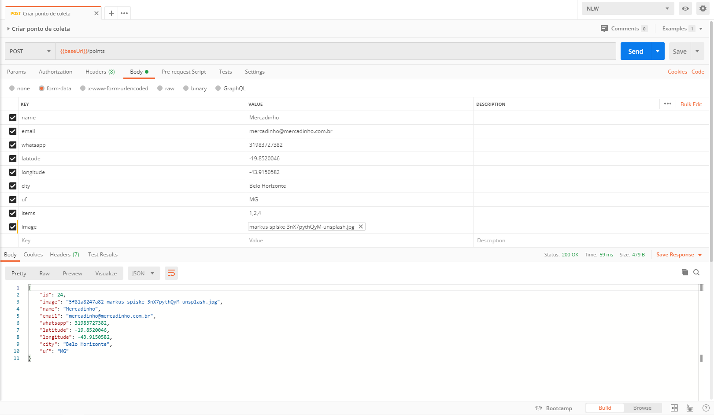

<h1 align="center">
  
  <br/>
  
</h1>

<p align="center">
  <a href="#-tecnologias">Tecnologias</a>&nbsp;&nbsp;&nbsp;|&nbsp;&nbsp;&nbsp;
  <a href="#-projeto">Projeto</a>&nbsp;&nbsp;&nbsp;|&nbsp;&nbsp;&nbsp;
  <a href="#-back-end">Back-end</a>&nbsp;&nbsp;&nbsp;|&nbsp;&nbsp;&nbsp;
  <a href="#-front-end">Front-end</a>&nbsp;&nbsp;&nbsp;|&nbsp;&nbsp;&nbsp;
  <a href="#-mobile">Mobile</a>&nbsp;&nbsp;&nbsp;|&nbsp;&nbsp;&nbsp;
  <a href="#-instalação">Instalação</a>&nbsp;&nbsp;&nbsp;|&nbsp;&nbsp;&nbsp;
  <a href="#-licença">Licença</a>
</p>

## 🚀 Tecnologias

- [Node.js](https://nodejs.org/en/)
- [React](https://reactjs.org)
- [React Native](https://facebook.github.io/react-native/)
- [Expo](https://expo.io/)
- [API do IBGE](https://servicodados.ibge.gov.br/api/docs/localidades?versao=1)
- [React Dropzone](https://react-dropzone.js.org/)
- [Leaflet](https://leafletjs.com/examples/quick-start/)
- [Celebrate](https://github.com/arb/celebrate) 
- [Multer](https://github.com/expressjs/multer)
- [Knex.js](http://knexjs.org/)
- [PostgeSQL](https://www.postgresql.org/)

## 💻 Projeto
Projeto desenvolvido durante a <strong>Next Level Week</strong>. 
O <strong>Ecoleta</strong> é uma plataforma onde pessoas/locais que fazem coleta de recicláveis podem ser facilmente encontradas por pessoas que necessitam reciclar algum item

## 🔨 Back-end
[](https://app.getpostman.com/run-collection/c9fdb4b05e0ae8f291de)
<h1 align="center">
    
</h1>

## 🌐 Front-end
<h1 align="center">
    
</h1>

## 📱 Mobile
<h1 align="center">
    
</h1>

## 🔥 Instalação

```bash
# Clone este repositório
$ git clone https://github.com/carolasilva/nlw-01.git

# Navegue em cada pasta: server / web / mobile e instale as depedências:
$ yarn install

# Navegue até a pasta server e execute os seguintes comandos:
$ yarn knex:migrate
$ yarn knex:seed
$ yarn dev:server

# Depois disso, entre na pasta web e execute o comando:
$ yarn start

# E finalmente, entre na pasta mobile e execunte o comando:
$ expo start

# Observações:
- Não esqueça de mudar a baseURL no arquivo api.ts das pastas web e mobile para o ip da sua máquina
- É necessário criar um banco de dados PostgreSQL e alterar as configurações no arquivo /src/database/connection.ts dentro da pasta server
```

## 🧾 Licença

Esse projeto está sob a licença MIT

---

Feito com 💗 por [Carol Alves](https://www.linkedin.com/in/carolinaarsilva/)
